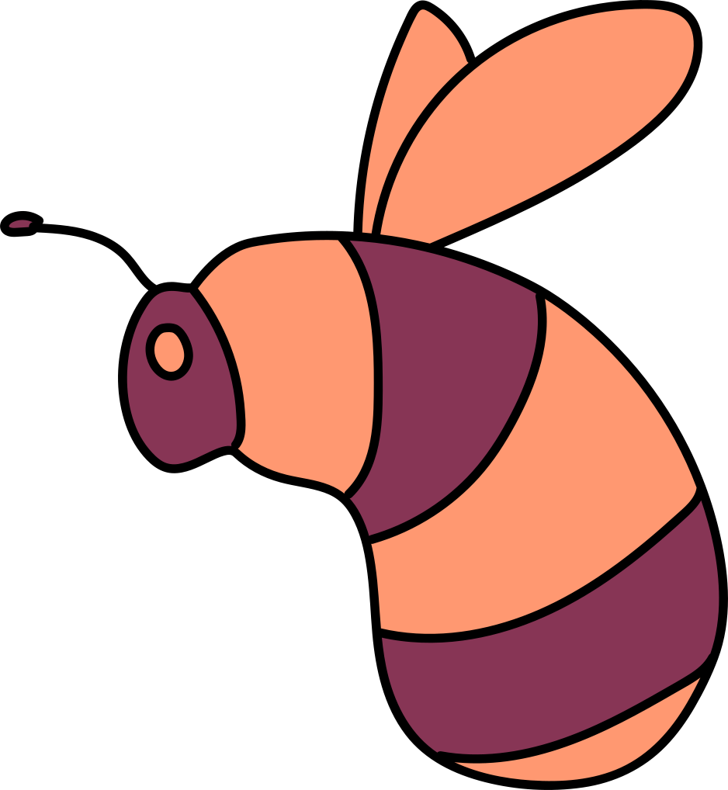

🐝 Behaviour Tree addon for Godot Engine!

# 🧪 Installation

1. [Download](https://github.com/bitbrain/beehave/archive/refs/heads/main.zip) this repository
2. Unpack the `beehave` folder into your `/addons` folder within the Godot project
3. Enable this addon within the Godot settings: `Project > Project Settings > Plugins`

# 📚 Getting started

Behaviour trees are a modular way to build AI logic for your game. For simple AI, behaviour trees are definitely overkill, however, for more complex AI interactions, behaviour trees can help you to better manage changes and re-use logic across all NPCs.

## What is a behaviour tree?

In a nutshell, a behaviour tree is a Godot Node that can be added as a child to other Godot nodes within the scene tree. It will run its logic every frame tick and modify the parent node accordingly.

In more theoretical terms, a behaviour tree consists of so called **nodes** - each node can be of a different type with different purposes. Those are described further down below in more detail. Every node has a `tick(actor, blackboard)` method that can be used to execute custom logic. When the `tick` function is called, beehave expects a return status of either `SUCCESS`, `RUNNING` or `FAILURE`.

## Actions and Conditions

Conditions are **leaf nodes** of type `ConditionLeaf`. They should be kept simple and either return `SUCCESS` or `FAILURE` depending on a single condition. Avoid creating conditions that check multiple things as it will become more difficult to reuse these nodes.

**1. Example Condition code: IsVisibleCondition.gd**

```gdscript
class_name IsVisibleCondition
extends ConditionLeaf

func tick(actor, blackboard):
    if actor.visible:
        return SUCCESS
    return FAILURE
```

Actions are **leaf nodes** of type `ActionLeaf`. They can be long running potentially being called across multiple frame executions. In this case return the code `RUNNING` .

**2. Example Condition code: MakeVisibleAction.gd**

```gdscript
class_name MakeVisibleAction
extends ActionLeaf

func tick(actor, blackboard):
    if actor.visible:
        return FAILURE
	actor.visible = true
    return SUCCESS
```

The **blackboard** is an object that can be used to store and access data between multiple nodes.

## Composites

In order to create logic flows based on conditions and actions, we need to _compose_ them through so called **composites**. A composite is a node that executes its children in a particular manner as described below.

### Selector

**Selector** nodes will attempt to execute each of its children and reports `SUCCESS` status code in case one of the children reports a `SUCCESS` status code. In case all children report a `FAILURE` status code, this node will also return `FAILURE` status code. This node will attempt to process all its children every single tick, even if one of them is currently `RUNNING` already.

### Selector Star

The **Selector Star** node is similar to the **Selector**, however, it will skip all previous child nodes that were executed prior, in case one of the children is currently in `RUNNING` state. A usecase for this is if you want to ensure that only one action is executed at a time, regardless of for long it runs.

### Sequence

**Sequence** nodes will attempt to execute all of its children and reports `SUCCESS` status code in case all of the children report a `SUCCESS` status code. In case at least one child reports a `FAILURE` status code, this node will also return `FAILURE` status code. This node will attempt to process all its children every single tick, even if one of them is currently `RUNNING` already.

### Sequence Star

The **Sequence Star** node is similar to the **Sequence**, however, it will skip all previous child nodes that succeeded prior, in case one of the children is currently in `RUNNING` state. A usecase for this is if you want to ensure that only one action is executed at a time, regardless of for long it runs.

## Decorators

**Decorators** are nodes that can be used in combination with any other node described above.

### Failer

A **failer** node will always return a `FAILURE` status code.

### Succeeder

A **succeeder** node will always return a `SUCCESS` status code.

### Inverter

A **inverter** will return `FAILURE` in case its child returns a `SUCCESS` status code or `SUCCESS` in case its child returns a `FAILURE` status code.

### Limiter

The limiter will execute its child `x` amount of times. When the number of maximum ticks is reached, it will return a `FAILURE` status code.

# 🍻 Contributing to this project

This project has been inspired by [the behaviour tree example](https://github.com/viniciusgerevini/godot-behavior-tree-example) of [https://github.com/viniciusgerevini](@viniciusgerevini). In case you want to suggest improvements to this addon or fix issues, feel free to raise a pull request!
